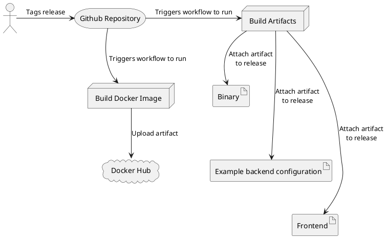

# Release Management

A Continuous Deployment (CD) pipeline will be used in order to ease the releasing and deploying of the tutor. For this, two workflows have been created: one that builds artifacts, and one that builds a docker image. Before the build artifacts job runs, tests will be executed in order to check if the system is still stable. 

## Considerations for running in the cloud

When deploying the tutor using cloud infrastructure, the docker image that is build can be used. Multiple online cloud service providers offer the running of docker containers:

- Amazon Web Services offers Amazon Elastic Compute Cloud
- Google Cloud Platform offers Google Kubernetes Engine
- Oracle Cloud Infrastructure offers Container Instances

