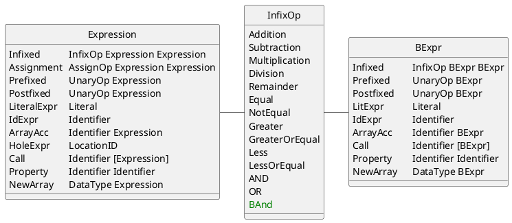
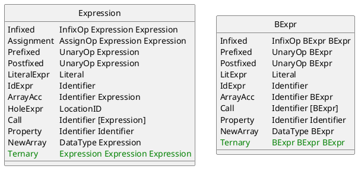

# Rules and Language Constructs

This page goes over design choices of various rules and language constructs.

## Buggy Rules

### BadArithmeticExpressionShortening

This buggy rule asks for the following pattern to be encoded:

`score = score - 3;` ~> `score =- 3;`  
`count = count + 1;` ~> `count = count++;`  
`score = score + 3;` ~> `score =+ 3;`  
`count = count - 1;` ~> `count = count--;`  

As this pattern is simple, and more importantly is not restricted by the context, we can leverage a simple collection of rewrite rules for this. This rule is not restricted by the context because of a few reasons:

1. It is a statement, not an expression.
2. If this statement would be executed anywhere it would lead to unexpected results, because the left hand side is not semantically the same as the right.

These 4 rules contain the pattern:

`x = x - a;` ~> `x =- a;`  
`x = x + 1;` ~> `x = x++;`  
`x = x + a;` ~> `x =+ a;`  
`x = x - 1;` ~> `x = x--;`  

### ForEachVariablesNotUpdated

When refactoring a for loop that loops over an array into a foreach, it is easy to forget to update array accessors in the body of the loop. This is the behavior we try to capture:

```java
for (int i = 0; i < values.length; i++) {
  print (values[i]);
}
```

Refactored into:

```java
for (int i : values) {
  print (values[i]);
}
```

This is a harder pattern to construct a rule for, unless a lot of assumptions are taken. The easiest way to define a pattern for this is using a rewrite rule. This would contain the following pattern:

`For(int x = 0; x < a.length; x++) body` ~> `ForEach(int x : a) body`

This pattern assumes the following:

- The name of the index counter on the left is the same as the variable name on the right.
- As the datatype of `values` is unknown during pattern matching we assume values is a list of integers.
- We assume the body does not change at all, and thus array accessors are left in the body.
- This also assumes a loop that starts at 0 and loops towards the length property of the list. &nbsp; `x <= a.length + 1` would be semantically similar, but would not be recognized.

Some of these assumptions can be helped by simply defining more rules that match all the possible combinations. Being able to define a rule based on the input would make this easier, and view based rules give this possibility.

A view based rule would have to match for the following, based on the following structure:

`For(init; cond; incr) body`

1. The statement is a `For`.
2. The `init` starts at zero.
3. The `cond` loops until the length of a identifier. 
4. The `incr` increments by one
5. The identifiers used for the index in 2, 3 and 4 are the same identifier.

After these matches the for can be rewritten to:

`ForEach(int c : arr) body`

Where `c` is the index identifier from 2, 3 or 4, and `arr` is the name of the identifier for the array being looped over found in 2.

Now, the assumption of using the integer type can be helped as well: by making the rule produce a `[Statement]` instead of `Maybe Statement` multiple buggy steps can be encoded. The list should be a list of all simple data types: integers, floating point numbers, characters, strings. We cannot simply only produce the correct transformation, as the type of `arr` is only known during runtime.

## Parser, Pretty Printer

### Bitwise AND

We want to implement support for the bitwise AND operator, as this operator was used multiple times in the experiment. For this, multiple stages of the tutor have to be modified. We start at the first step, being able to parse and evaluate the bitwise AND operator. For this the three stages in figure \ref{parseconveval} will have to be modified.

\begin{figure}
\begin{center}
\smartdiagramset{back arrow disabled=true, sequence item width=3cm, text width=2.75cm, module x sep=3.75cm}
\smartdiagram[flow diagram:horizontal]{Parser,Converter,Evaluator}
\end{center}
\caption{Evaluation pipeline}
\label{parseconveval}
\end{figure}

An modified vendored module is used to parse the code into an Java AST representing the Java code. This Java AST is very complex still, and needs to be converted into the Syntax AST used by the tutor. This is done in the parser. The Syntax AST is then used for rewrite rules. Although simpler than the Java AST, the Syntax AST still contains a lot of specifics unrelated to evaluating it, and thus is converted once again into a Base AST. This Base AST contains similar but a simplified structure of the Syntax AST. This Base AST is then fed to the evaluator, which evaluates and produces a result.

Because the bitwise operators are such a basic operators, it will need to be added to all three phases for it to work correctly. As it is an operator, it will need to be added to the following operator datatypes:

- Syntax AST: `InfixOp` (Infixed Operator).
- Base AST: reuses `InfixOp` from the Syntax AST.
- Evaluator: `Evaluation BExpr` uses `calc` to parse `InfixOp`.



After adding these definitions, the matching pipeline has to be updated as well. This pipeline is used for generating feedback. For this the converted Syntax AST needs to be able to be converted back into Java code. Figure \ref{Matching} shows the steps required. The Parser has already been updated in the previous paragraph, and the rules work on the same Syntax AST so do not need updating.

\begin{figure}
\begin{center}
\smartdiagramset{back arrow disabled=true, sequence item width=3cm, text width=2.75cm, module x sep=3.75cm}
\smartdiagram[flow diagram:horizontal]{Parser,Rules,Pretty Printer}
\end{center}
\caption{Matching pipeline}
\label{Matching}
\end{figure}

The pretty printer needs a suitable definition for the `Pretty` typeclass on the `InfixOp`. This definition should give that $pretty \circ parse \sim id$, meaning that running `pretty` after `parse` is similar to the identity. 

### Ternary

Similar to the bitwise operators, the ternary operator needs adding to the same two pipelines. The ternary operator is an operator on its own, and not part of a collection such as `InfixOp`, and therefore needs a new constructor on multiple places. For the evaluation pipeline, these are:

- Syntax AST: `Expression` needs a new `Ternary` constructor.
- Base AST: `BExpr` needs a new `Ternary` constructor.
- Evaluator: `Evaluation BExpr` needs a new pattern match for the `BExpr.Ternary` constructor.

For converting the Syntax AST back to code, the pretty printer needs a suitable definition for the `Ternary` constructor in the `Pretty Expression` instance.



