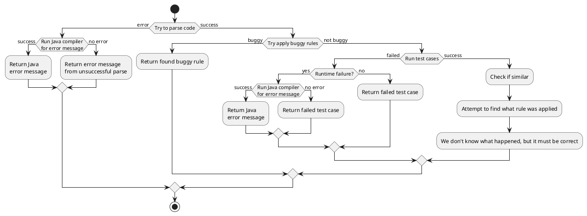

# Services

## diagnoseRS

```plantuml
@startuml
start
if (Try to parse code) then (error)
  if (Run Java compiler\nfor error message) then (success)
    :Return Java 
    error message;
  else (no error)
    :Return error message 
    from unsuccessful parse;
  endif
else (success)
  if (Try apply buggy rules) then (buggy)
    :Return found buggy rule;
  else (not buggy)
    if(Run test cases) then (failed)
      if(Runtime failure?) then (yes)
        if (Run Java compiler\nfor error message) then (success)
          :Return Java 
          error message;
        else (no error)
          :Return failed test case;
        endif
      else (no)
        :Return failed test case;
      endif
    else (success)
    :Check if similar;
    :Attempt to find what rule was applied;
    :We don't know what happened, but it must be correct;
    endif
  endif
endif

stop
@enduml
```

